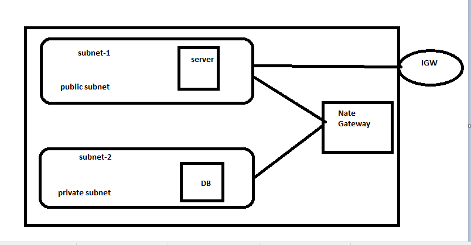

# About vpc
* vpc is a region bound
* vpc is a collection of subnets which can be in a same or different       availability zones.
### public subnet
* it means it is directly connected to the IGW and traffic is allowed to in and out.

