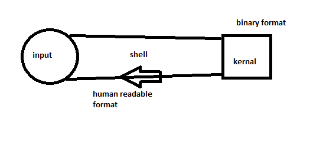
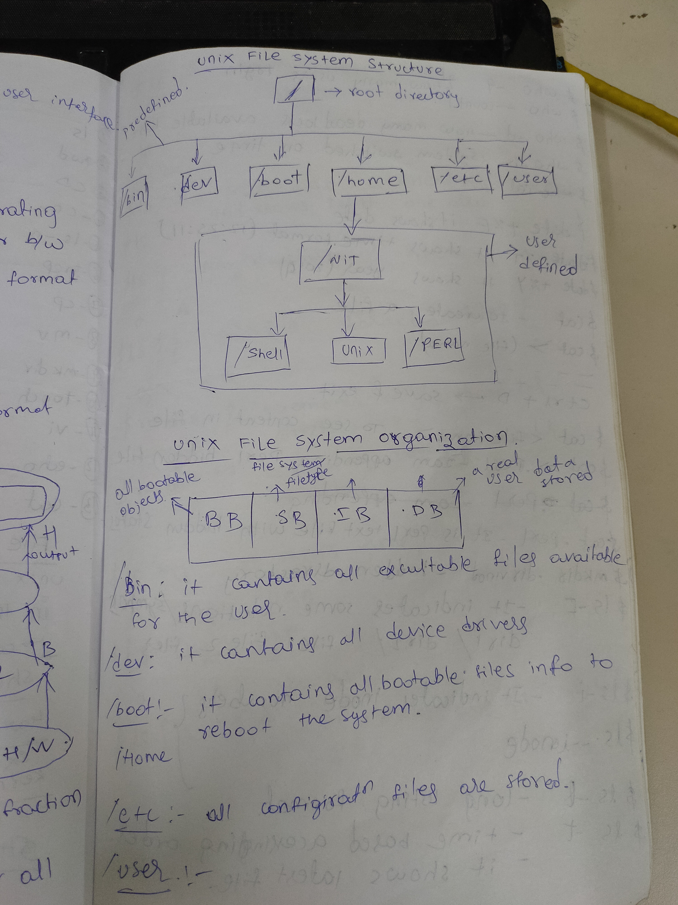
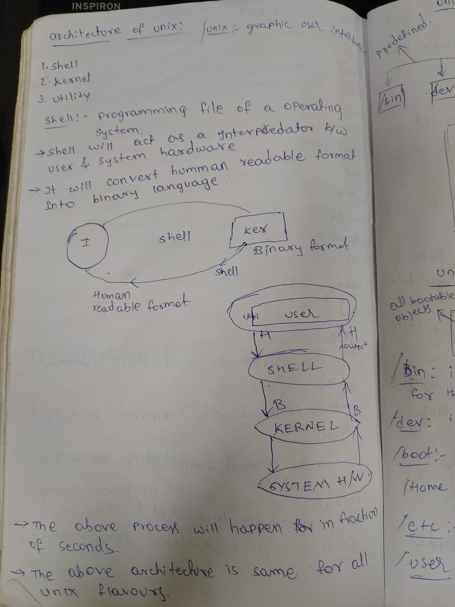

   # LINUX NOTES
* OS is a software which operates all hardware components.

   ## File system: 
   * file system is a collection of files and directories stored in
     different format of the disk. 
   * unix file system is used store information in the files.
   * all operating systems(OS) are depends on file systems.
   
   ## Types of file systems
   * disk based file systems.
   * network based file systems.
   * virtual based file systems.

   ### ext2/ext3/ext4/xfs: these file systems are used by linux operating systems.
   
   ## shell
   ## kernel

### shell: 
  * collection of unix commands is called shell.
  * shell is programming file of a operating system
  * shell will act as a interpedator between user and system hardware
  * shell is a high level programming 
       
kernel: - 
* is a low level programming
* it is a interpedator between shell and system hardware.



UNIX FILE SYSTEMS:



```
* / : root directory
* /BIN: it contains all excutable files available for the user.
* /dev: it contains all device drivers.
* /boot: it contains all bootable files info,to reboot the system.
* /etc: all configiration files are stored.
```

